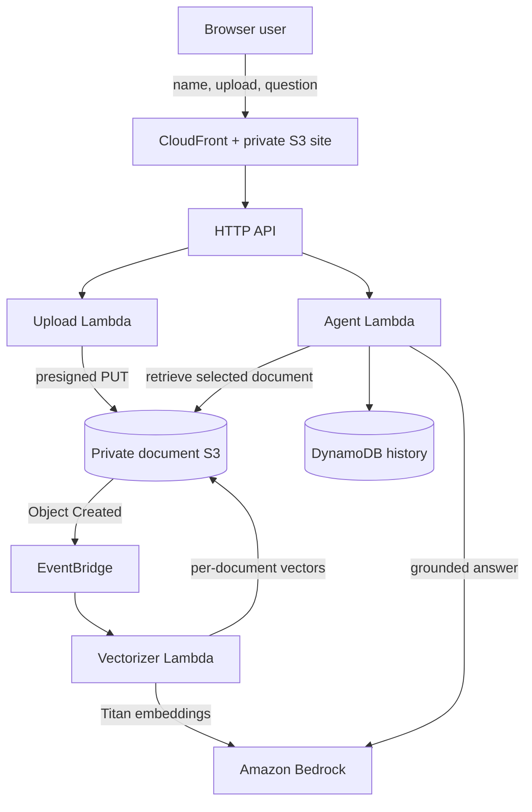

# Friendly Document Assistant

A deployable serverless RAG application based on the supplied `agent_v7.py` and `embed_documents_v5_s3.py`. Users enter their name, upload one TXT or text-based PDF, wait for vectorization, and chat strictly against that selected document. Chat turns are stored in DynamoDB under the supplied name as `userId`.

## Architecture



The browser/API replaces Amazon Lex from the original conceptual diagram. For typed website chat, API Gateway already transports the exact user message; Lex intent recognition would duplicate that job and does not improve RAG retrieval. The Lambda agent remains the orchestrator, Bedrock remains the LLM, and vector retrieval is its document tool.

## What is included

- Private S3 website origin served over HTTPS through CloudFront
- Direct browser uploads to a separate private S3 bucket by 15-minute presigned URL
- TXT and text-based PDF extraction, 900-character chunks, 150-character overlap
- Titan Text Embeddings V2 with normalized, configurable vectors (512 dimensions by default)
- A separate S3 vector index for every `userId` + `documentId`
- Anthropic Claude Haiku 4.5 answers through a US geographic cross-Region inference profile, with a strict grounding prompt and prompt-injection boundary
- DynamoDB document status and per-user chat history with point-in-time recovery
- Ready-document selection so the same name can resume earlier document conversations
- EventBridge-driven asynchronous vectorization and frontend readiness polling
- Automatic previous-session history plus `history`, `clear history`, and `exit`/`bye` chat commands
- A shared NumPy/PyPDF Lambda layer attached only to the functions that need native document/vector dependencies
- Least-purpose Lambda roles, encryption, versioning, X-Ray, throttling, and upload limits

## Important identity limitation

The requested name is stored as the DynamoDB `userId`. A name is **not authentication**: two people using the same spelling would share that logical history, and a visitor could impersonate another name. This is appropriate only for a portfolio/demo. Before storing private or regulated documents, add Amazon Cognito and use the immutable Cognito `sub` as the partition key while keeping the person's name as a display attribute.

## Prerequisites

1. AWS CLI v2, Docker, and AWS SAM CLI installed on your Mac.
2. AWS credentials configured (`aws sts get-caller-identity` should succeed).
3. Deploy to a source Region supported by `amazon.titan-embed-text-v2:0` and the Claude Haiku 4.5 US inference profile—the defaults use `us-east-1`.
4. Permission to create CloudFormation, IAM, Lambda, S3, DynamoDB, API Gateway, EventBridge, CloudFront, and Bedrock resources.
5. Anthropic model access enabled for the AWS account. First-time Anthropic users must submit the Bedrock model use-case form and accept any required model agreement.

AWS documents Titan V2's optional `dimensions` and `normalize` request fields and supports 256, 512, or 1,024 dimensions. This project defaults to normalized 512-dimensional vectors to reduce index size, S3 transfer, memory, and comparison work while retaining good retrieval quality for small documents. Set `EmbeddingDimensions=1024` when retrieval quality matters more than those savings. Claude Haiku 4.5 supports the Bedrock Converse API. By default, the chat Lambda invokes the account-scoped ARN for `global.anthropic.claude-haiku-4-5-20251001-v1:0`; `us.anthropic.claude-haiku-4-5-20251001-v1:0` is retained as the first fallback.

## Deploy

```bash
chmod +x scripts/deploy.sh scripts/delete-stack.sh
./scripts/deploy.sh
```

The script runs `sam build --use-container`, creates and executes an AWS CloudFormation change set through `sam deploy`, writes the generated API URL into `frontend/config.js` in a temporary staging directory, syncs the site to S3, invalidates CloudFront, and prints the HTTPS website URL. SAM is a CloudFormation transform—not a separate infrastructure engine—and CloudFormation owns the resulting stack and resources.

The container build is required for NumPy: it creates Linux/ARM64-compatible compiled dependencies even when deployment starts on an Intel or Apple Silicon Mac.

To choose a stack name:

```bash
./scripts/deploy.sh my-friendly-assistant
```

To update an existing stack's `LlmModelId`, pass the model ID as the second argument:

```bash
./scripts/deploy.sh friendly-doc-assistant us.anthropic.claude-haiku-4-5-20251001-v1:0
```

You can also provide it through an environment variable:

```bash
LLM_MODEL_ID=us.anthropic.claude-haiku-4-5-20251001-v1:0 ./scripts/deploy.sh
```

The script adds a CloudFormation parameter override only when one of these values is supplied. A second argument takes precedence over the environment variable.

To change models or chunk settings, run `sam deploy --guided` once or add parameter overrides:

```bash
sam deploy --parameter-overrides \
  BedrockRegion=us-east-1 \
  EmbeddingModelId=amazon.titan-embed-text-v2:0 \
  LlmModelId=amazon.nova-lite-v1:0 \
  EmbeddingDimensions=512 \
  ChunkSize=900 ChunkOverlap=150
```

The chat model targets are attempted in this order:

1. The global inference-profile ARN generated from `InferenceProfileId`, the deployment Region, and the deploying AWS account, when `UseInferenceProfile=true`.
2. `LlmModelId` (US Claude Haiku 4.5 by default).
3. `SonnetFallbackModelId`.
4. `NovaLiteFallbackModelId`.
5. `NovaMicroFallbackModelId`.

Duplicate or empty targets are skipped. A Bedrock client error is logged with the target and error code before the next target is attempted. If every target fails, the last Bedrock exception is logged by the request handler and the API returns its troubleshooting `requestId`.

Claude Haiku and Sonnet do not accept `temperature` and `topP` together through this Converse invocation. The application therefore sends `maxTokens` plus `temperature` to Anthropic targets. Nova Lite and Nova Micro receive `maxTokens`, `temperature`, and `topP`. The corresponding Lambda settings default to `500`, `0.2`, and `0.9` and can be changed through `BEDROCK_MAX_TOKENS`, `BEDROCK_TEMPERATURE`, and `BEDROCK_TOP_P` in the template.

## Request flow

1. The name form establishes `userId`; the app lists that name's ready documents so a later session can resume one and reuse its saved chat memory.
2. `POST /uploads` validates the filename and size and returns a presigned S3 PUT URL.
3. S3 emits `Object Created` through EventBridge.
4. `embed_documents_v5_s3.handler` extracts text, chunks it, calls Titan, stores a NumPy `float32` matrix as `vectors.npy` plus `chunks.json`, and marks the document `READY`.
5. The browser polls `GET /documents/status` and enables chat only after `READY`.
6. `POST /chat` verifies that the document belongs to that `userId`, retrieves the top four chunks with cosine similarity, includes recent turns for continuity, invokes Claude Haiku 4.5, and stores the answer.
7. `GET /history` restores all saved turns for the active name, while `DELETE /history` clears them in DynamoDB batches.

Names are normalized to uppercase in the browser so capitalization variants share the same frontend identity. The chat composer recognizes local session commands: `history` reloads the active user's saved turns, `clear history` removes them, and `exit` or `bye` returns to the name screen. Enter submits a question; Shift+Enter inserts a new line.

History from other documents is deliberately excluded so an answer about a newly uploaded document cannot leak facts from the car manual or a previous upload.

## Test and validate

```bash
python3 -m compileall backend tests
python3 -m unittest discover -s tests -v
sam validate --lint
```

After deployment, upload a small TXT file containing a unique fact, ask for that fact, then ask an unrelated question. The second response should be: `I couldn't find that information in the provided document.` Also verify that a scanned image-only PDF ends in `FAILED`; OCR is intentionally not included.

## Operational notes

- The 10 MB upload cap and 2,000-chunk cap protect a demo stack from unexpectedly large embedding jobs.
- NumPy performs vectorized dot-product similarity against normalized embeddings. This is substantially faster and more compact than Python loops while avoiding the fixed cost of an always-on managed vector database. It is suitable for small/medium single documents, not a large corpus. At larger scale, replace the S3 NumPy index with OpenSearch Serverless, Aurora PostgreSQL/pgvector, or another managed vector index.
- The vectorization Lambda can run for up to 15 minutes. Large documents may generate many synchronous Bedrock calls and should be moved to Step Functions or an SQS worker if you raise the limits.
- CORS is open because CloudFront's generated hostname is not known until stack creation. For production, use a custom domain and restrict both API and upload-bucket CORS to that origin.
- The stack creates a dedicated `/aws/lambda/<stack-name>-chat` CloudWatch log group with JSON logging and 14-day retention. Override `LogRetentionDays` during deployment if needed. Lambda metrics, API metrics, and X-Ray traces are also available.

## Troubleshoot Claude model invocation

The browser message `The assistant could not answer right now.` is the API's intentional generic response for an unhandled chat error. It does not identify the Bedrock failure. The response includes a Lambda `requestId`, and the complete exception and stack trace are written to the dedicated chat log group without logging the question or document excerpts. A validation message stating that `temperature` and `top_p` cannot both be specified means the Anthropic target was sent a Nova-compatible inference configuration; the model-aware configuration in this version fixes that condition.

Switching from Nova Lite to `us.anthropic.claude-haiku-4-5-20251001-v1:0` changes both the model provider and invocation resource. The `us.` ID is a geographic cross-Region inference profile. The most common failures are:

- Anthropic access has not been activated for this account. In the Bedrock console, open **Model access**, submit the one-time Anthropic use-case details if prompted, and confirm Claude Haiku 4.5 is available.
- An AWS Organizations SCP or permission boundary blocks Bedrock in one of the profile's destination Regions. A geographic profile fails if any required destination Region is denied. Allow `bedrock:InvokeModel` for the inference profile and its destination foundation models in every Region returned by `get-inference-profile`.
- `BedrockRegion` is not a supported source Region for that profile, or the model ID was copied incorrectly. The default combination is `us-east-1` and `us.anthropic.claude-haiku-4-5-20251001-v1:0`.

The stack's Lambda role already permits `bedrock:InvokeModel`; account-level model access and Organizations SCPs cannot be granted by this application stack. Verify the profile and inspect the latest errors with:

```bash
aws bedrock get-inference-profile \
  --region us-east-1 \
  --inference-profile-identifier us.anthropic.claude-haiku-4-5-20251001-v1:0

LOG_GROUP=$(aws cloudformation describe-stacks \
  --stack-name friendly-doc-assistant \
  --region us-east-1 \
  --query "Stacks[0].Outputs[?OutputKey=='ChatLogGroupName'].OutputValue" \
  --output text)

aws logs tail "$LOG_GROUP" --region us-east-1 --since 10m --follow
```

Look for `AccessDeniedException`, `FTUFormNotFilled`, `ValidationException`, or an SCP-related denial. Redeploy after model access or policy changes; no application code change is required for those account-level fixes.

## GitHub Actions CI/CD pipeline

The workflow in `.github/workflows/pipeline.yaml` uses GitHub OIDC and short-lived AWS credentials. It runs automatically for a push to `main` and can also be started from the GitHub Actions **Run workflow** button. It does not use repository access-key secrets or AWS CodePipeline.

The stages run in this order:

1. Validate — Python 3.12 compilation, unit tests, and `sam validate --lint`.
2. Build/package — containerized SAM build for Linux ARM64, followed by separate test and production packages.
3. Deploy test — deploy `friendly-doc-assistant-test` with seven-day chat-log retention.
4. Publish test frontend — inject the test API URL, sync the private website bucket, and invalidate CloudFront.
5. Integration test — call the deployed `/documents` endpoint and validate its JSON contract.
6. Production approval — the `production` GitHub Environment pauses the workflow for an authorized reviewer.
7. Deploy production — deploy `friendly-doc-assistant-prod`, publish its frontend, and run the same API smoke test with 14-day chat-log retention.

Before the first run, configure the following outside the repository:

- Create the GitHub OIDC provider in AWS IAM with audience `sts.amazonaws.com`.
- Allow the test pipeline role to assume the role from `repo:kj21709/friendly-doc-assistant:ref:refs/heads/main`.
- Allow the production pipeline role from both `repo:kj21709/friendly-doc-assistant:ref:refs/heads/main` (packaging) and `repo:kj21709/friendly-doc-assistant:environment:production` (deployment).
- Create a GitHub Environment named `production`, restrict it to `main`, and configure a required reviewer.
- Ensure both pipeline execution roles can call `cloudformation:DescribeStacks`, sync the corresponding generated website bucket (`s3:ListBucket`, `s3:GetObject`, `s3:PutObject`, and `s3:DeleteObject`), and call `cloudfront:CreateInvalidation`. The SAM bootstrap roles normally cover packaging and CloudFormation role assumption; frontend publication may require this additional inline policy.
- Keep each CloudFormation execution role trusted by CloudFormation and passable by only its corresponding pipeline execution role.

Attach an inline frontend-publication policy to each pipeline execution role if those permissions are not already present. Replace `<STACK_NAME>` with `friendly-doc-assistant-test` on the test role and `friendly-doc-assistant-prod` on the production role:

```json
{
  "Version": "2012-10-17",
  "Statement": [
    {
      "Effect": "Allow",
      "Action": "cloudformation:DescribeStacks",
      "Resource": "arn:aws:cloudformation:us-east-1:843553758024:stack/<STACK_NAME>/*"
    },
    {
      "Effect": "Allow",
      "Action": "s3:ListBucket",
      "Resource": "arn:aws:s3:::<STACK_NAME>-websitebucket-*"
    },
    {
      "Effect": "Allow",
      "Action": ["s3:GetObject", "s3:PutObject", "s3:DeleteObject"],
      "Resource": "arn:aws:s3:::<STACK_NAME>-websitebucket-*/*"
    },
    {
      "Effect": "Allow",
      "Action": "cloudfront:CreateInvalidation",
      "Resource": "arn:aws:cloudfront::843553758024:distribution/*"
    }
  ]
}
```

CloudFormation lowercases generated S3 bucket names, so the stack-name patterns above are lowercase intentionally. If your organization disallows wildcard distribution access, deploy the stack once, read its `DistributionId` output, and replace `distribution/*` with that exact distribution ID.

To start the pipeline with a commit:

```bash
git add .github/workflows/pipeline.yaml scripts README.md frontend
git commit -m "Complete GitHub Actions deployment pipeline"
git push origin main
```

Open **GitHub → friendly-doc-assistant → Actions → Pipeline** and follow the active run. After test deployment, publication, and the smoke test pass, approve the pending `production` Environment deployment. The workflow then deploys and verifies production.

For a manual run without a new commit, open **Actions → Pipeline → Run workflow**, choose `main`, and select **Run workflow**. GitHub runs the exact committed revision; local uncommitted changes are never included.

The smoke test is intentionally non-destructive: it verifies API Gateway, Lambda, and DynamoDB connectivity plus the response contract without uploading a document or incurring an LLM request. Run a full upload/vectorization/chat acceptance test manually after the first successful pipeline, then automate that longer test separately if its Bedrock cost and duration are acceptable.

## Cleanup

The buckets are versioned, so CloudFormation cannot remove non-empty buckets itself. The helper removes object versions and deletion markers, then deletes the stack:

```bash
./scripts/delete-stack.sh
```

For a production system, use a retention/deletion policy appropriate to your data requirements rather than automatically deleting stored documents and history.
