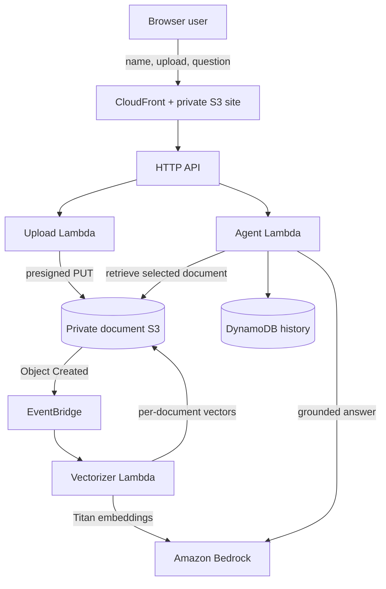

# Friendly Document Assistant

I built this serverless document chatbot as part of my transition from IT Analyst work into AWS Cloud Engineering. The project gave me hands-on experience with infrastructure as code, serverless services, Amazon Bedrock, retrieval-augmented generation (RAG), logging, security roles, and automated deployments.

Users can upload a TXT or text-based PDF, wait for it to be indexed, and ask questions against that selected document. The goal is not to create a general-purpose chatbot. It is to provide answers grounded in an approved document and clearly refuse questions that the document cannot answer.

## Portfolio goal

As an IT Analyst, I regularly work with technical procedures, troubleshooting notes, support documentation, and company policies. I wanted to explore how AWS could turn that type of information into a searchable internal assistant while keeping the source documents private and separating each document's knowledge index.

This project demonstrates my ability to:

- Translate an IT support use case into a cloud architecture
- Build and connect managed AWS services with SAM and CloudFormation
- Use Amazon Bedrock for embeddings and language-model responses
- Add practical controls that reduce unsupported AI answers
- Troubleshoot IAM, OIDC, model invocation, ARM64 builds, and deployment issues
- Move a local Docker-based deployment into a test-to-production CI/CD pipeline

## Example business uses

### Internal IT support

An IT team could upload approved knowledge-base articles, standard operating procedures, onboarding instructions, or troubleshooting guides. Support staff could ask questions such as “How do I reset this application?” or “What are the escalation steps?” and receive an answer based on the selected document. This could reduce time spent searching shared folders while keeping the original document as the source of truth.

### HR policy assistant

The same design could support approved employee handbooks, leave policies, benefit summaries, or onboarding documents. Employees could ask plain-language questions and receive document-grounded answers. A real HR deployment would require authentication, authorization, privacy review, audit controls, and careful handling of sensitive information.

## Hallucination controls

The application uses several guardrails to reduce hallucination risk:

- It retrieves only the four most relevant excerpts from the selected document.
- The system prompt requires every factual statement to be supported by those excerpts.
- Document excerpts are placed inside explicit `<excerpt>` boundaries so document text is treated as evidence rather than system instructions.
- If the excerpts are insufficient, the assistant must respond: `I couldn't find that information in the provided document.`
- Previous conversation is used only for continuity and is explicitly not treated as factual evidence.
- Chat history from other documents is excluded from the prompt.
- A low temperature is used to make responses more consistent.
- Each uploaded document receives a separate vector index, reducing accidental cross-document retrieval.

These controls reduce risk but do not guarantee that a model can never produce an incorrect response. Before using this design for sensitive production decisions, I would add Amazon Bedrock Guardrails, source citations, automated groundedness evaluations, authenticated users, and human review for high-impact answers.

## Architecture



The browser/API replaces Amazon Lex from the original conceptual diagram. For typed website chat, API Gateway already transports the exact user message; Lex intent recognition would duplicate that job and does not improve RAG retrieval. The Lambda agent remains the orchestrator, Bedrock remains the LLM, and vector retrieval is its document tool.

## What is included

- Private S3 website origin served over HTTPS through CloudFront
- Direct browser uploads to a separate private S3 bucket by 15-minute presigned URL
- TXT and text-based PDF extraction, 900-character chunks, 150-character overlap
- Titan Text Embeddings V2 with normalized, configurable vectors (512 dimensions by default)
- A separate S3 vector index for every `userId` + `documentId`
- Anthropic Claude Haiku 4.5 answers through a configurable Bedrock inference profile, with a strict grounding prompt and prompt-injection boundary
- DynamoDB document status and per-user chat history with point-in-time recovery
- Ready-document selection so the same name can resume earlier document conversations
- EventBridge-driven asynchronous vectorization and frontend readiness polling
- Automatic previous-session history plus `history`, `clear history`, and `exit`/`bye` chat commands
- A shared NumPy/PyPDF Lambda layer attached only to the functions that need native document/vector dependencies
- Separate API and vectorizer Lambda roles, encryption, versioning, X-Ray, throttling, and upload limits

## Important identity limitation

The requested name is stored as the DynamoDB `userId`. Name/UserId used is not for authentication purposes. this is simply to keep track of chat history.

## Prerequisites

1. AWS CLI v2, Docker, and AWS SAM CLI installed on your Mac.
2. AWS credentials configured (`aws sts get-caller-identity` should succeed).
3. Deploy to a source Region supported by `amazon.titan-embed-text-v2:0` and the configured Claude Haiku 4.5 inference profile—the defaults use `us-east-1`.
4. Permission to create CloudFormation, IAM, Lambda, S3, DynamoDB, API Gateway, EventBridge, CloudFront, and Bedrock resources.
5. Anthropic model access enabled for the AWS account. First-time Anthropic users must submit the Bedrock model use-case form and accept any required model agreement.

AWS documents Titan V2's optional `dimensions` and `normalize` request fields and supports 256, 512, or 1,024 dimensions. This project defaults to normalized 512-dimensional vectors to reduce index size, S3 transfer, memory, and comparison work while retaining good retrieval quality for small documents. Set `EmbeddingDimensions=1024` when retrieval quality matters more than those savings. Claude Haiku 4.5 supports the Bedrock Converse API. By default, the chat Lambda invokes the account-scoped ARN for `global.anthropic.claude-haiku-4-5-20251001-v1:0`; `us.anthropic.claude-haiku-4-5-20251001-v1:0` is retained as the first fallback.

## Deploy

```bash
chmod +x scripts/deploy.sh scripts/delete-stack.sh
./scripts/deploy.sh
```

The script runs `sam build --use-container`, creates and executes an AWS CloudFormation change set through `sam deploy`, writes the generated API URL into `frontend/config.js` in a temporary staging directory, syncs the site to S3, invalidates CloudFront, and prints the HTTPS website URL. SAM is a CloudFormation transform—not a separate infrastructure engine—and CloudFormation owns the resulting stack and resources.

The container build is required for NumPy: it creates Linux/ARM64-compatible compiled dependencies even when deployment starts on an Intel or Apple Silicon Mac.

To choose a stack name:

```bash
./scripts/deploy.sh my-friendly-assistant
```

To update an existing stack's `LlmModelId`, pass the model ID as the second argument:

```bash
./scripts/deploy.sh friendly-doc-assistant us.anthropic.claude-haiku-4-5-20251001-v1:0
```

You can also provide it through an environment variable:

```bash
LLM_MODEL_ID=us.anthropic.claude-haiku-4-5-20251001-v1:0 ./scripts/deploy.sh
```

The script adds a CloudFormation parameter override only when one of these values is supplied. A second argument takes precedence over the environment variable.

To change models or chunk settings, run `sam deploy --guided` once or add parameter overrides:

```bash
sam deploy --parameter-overrides \
  BedrockRegion=us-east-1 \
  EmbeddingModelId=amazon.titan-embed-text-v2:0 \
  LlmModelId=amazon.nova-lite-v1:0 \
  EmbeddingDimensions=512 \
  ChunkSize=900 ChunkOverlap=150
```

The chat model targets are attempted in this order:

1. The global inference-profile ARN generated from `InferenceProfileId`, the deployment Region, and the deploying AWS account, when `UseInferenceProfile=true`.
2. `LlmModelId` (US Claude Haiku 4.5 by default).
3. `SonnetFallbackModelId`.
4. `NovaLiteFallbackModelId`.
5. `NovaMicroFallbackModelId`.

Duplicate or empty targets are skipped. A Bedrock client error is logged with the target and error code before the next target is attempted. If every target fails, the last Bedrock exception is logged by the request handler and the API returns its troubleshooting `requestId`.

Claude Haiku and Sonnet do not accept `temperature` and `topP` together through this Converse invocation. The application therefore sends `maxTokens` plus `temperature` to Anthropic targets. Nova Lite and Nova Micro receive `maxTokens`, `temperature`, and `topP`. The corresponding Lambda settings default to `500`, `0.2`, and `0.9` and can be changed through `BEDROCK_MAX_TOKENS`, `BEDROCK_TEMPERATURE`, and `BEDROCK_TOP_P` in the template.

## Request flow

1. The name form establishes `userId`; the app lists that name's ready documents so a later session can resume one and reuse its saved chat memory.
2. `POST /uploads` validates the filename and size and returns a presigned S3 PUT URL.
3. S3 emits `Object Created` through EventBridge.
4. `embed_documents_v5_s3.handler` extracts text, chunks it, calls Titan, stores a NumPy `float32` matrix as `vectors.npy` plus `chunks.json`, and marks the document `READY`.
5. The browser polls `GET /documents/status` and enables chat only after `READY`.
6. `POST /chat` verifies that the document belongs to that `userId`, retrieves the top four chunks with cosine similarity, includes recent turns for continuity, invokes Claude Haiku 4.5, and stores the answer.
7. `GET /history` restores all saved turns for the active name, while `DELETE /history` clears them in DynamoDB batches.

Names are normalized to uppercase in the browser so capitalization variants share the same frontend identity. The chat composer recognizes local session commands: `history` reloads the active user's saved turns, `clear history` removes them, and `exit` or `bye` returns to the name screen. Enter submits a question; Shift+Enter inserts a new line.

History from other documents is deliberately excluded so an answer about a newly uploaded document cannot leak facts from the car manual or a previous upload.

## Test and validate

```bash
python3 -m compileall backend tests
python3 -m unittest discover -s tests -v
sam validate --lint
```

After deployment, upload a small TXT file containing a unique fact, ask for that fact, then ask an unrelated question. The second response should be: `I couldn't find that information in the provided document.` Also verify that a scanned image-only PDF ends in `FAILED`; OCR is intentionally not included.

## Operational notes

- The 12 MB upload cap and 2,000-chunk cap protect a demo stack from unexpectedly large embedding jobs.
- NumPy performs vectorized dot-product similarity against normalized embeddings. This is substantially faster and more compact than Python loops while avoiding the fixed cost of an always-on managed vector database. It is suitable for small/medium single documents, not a large corpus. At larger scale, replace the S3 NumPy index with OpenSearch Serverless, Aurora PostgreSQL/pgvector, or another managed vector index.
- The vectorization Lambda can run for up to 15 minutes. Large documents may generate many synchronous Bedrock calls and should be moved to Step Functions or an SQS worker if you raise the limits.
- CORS is open because CloudFront's generated hostname is not known until stack creation. For production, use a custom domain and restrict both API and upload-bucket CORS to that origin.
- The stack creates a dedicated `/aws/lambda/<stack-name>-chat` CloudWatch log group with JSON logging and 14-day retention. Override `LogRetentionDays` during deployment if needed. Lambda metrics, API metrics, and X-Ray traces are also available.

## Troubleshoot Claude model invocation

The browser message `The assistant could not answer right now.` is the API's intentional generic response for an unhandled chat error. It does not identify the Bedrock failure. The response includes a Lambda `requestId`, and the complete exception and stack trace are written to the dedicated chat log group without logging the question or document excerpts. A validation message stating that `temperature` and `top_p` cannot both be specified means the Anthropic target was sent a Nova-compatible inference configuration; the model-aware configuration in this version fixes that condition.

Switching from Nova Lite to `us.anthropic.claude-haiku-4-5-20251001-v1:0` changes both the model provider and invocation resource. The `us.` ID is a geographic cross-Region inference profile. The most common failures are:

- Anthropic access has not been activated for this account. In the Bedrock console, open **Model access**, submit the one-time Anthropic use-case details if prompted, and confirm Claude Haiku 4.5 is available.
- An AWS Organizations SCP or permission boundary blocks Bedrock in one of the profile's destination Regions. A geographic profile fails if any required destination Region is denied. Allow `bedrock:InvokeModel` for the inference profile and its destination foundation models in every Region returned by `get-inference-profile`.
- `BedrockRegion` is not a supported source Region for that profile, or the model ID was copied incorrectly. The default combination is `us-east-1` and `us.anthropic.claude-haiku-4-5-20251001-v1:0`.

The stack's Lambda role already permits `bedrock:InvokeModel`; account-level model access and Organizations SCPs cannot be granted by this application stack. Verify the profile and inspect the latest errors with:

```bash
aws bedrock get-inference-profile \
  --region us-east-1 \
  --inference-profile-identifier us.anthropic.claude-haiku-4-5-20251001-v1:0

LOG_GROUP=$(aws cloudformation describe-stacks \
  --stack-name friendly-doc-assistant \
  --region us-east-1 \
  --query "Stacks[0].Outputs[?OutputKey=='ChatLogGroupName'].OutputValue" \
  --output text)

aws logs tail "$LOG_GROUP" --region us-east-1 --since 10m --follow
```

Look for `AccessDeniedException`, `FTUFormNotFilled`, `ValidationException`, or an SCP-related denial. Redeploy after model access or policy changes; no application code change is required for those account-level fixes.

## GitHub Actions CI/CD pipeline

I initially deployed the project from my Mac with AWS SAM and Docker Desktop. Docker was needed because the Lambda layer includes NumPy and must be built for the Linux ARM64 Lambda environment rather than the local macOS environment. The local workflow helped me understand each step: build the application, package artifacts, deploy the CloudFormation stack, publish the frontend to S3, and invalidate CloudFront.

I then evolved that manual process into `.github/workflows/pipeline.yaml`. GitHub Actions now performs the repeatable build and deployment process, and GitHub OIDC provides temporary AWS credentials instead of storing long-lived access keys in the repository. A native ARM64 GitHub runner builds the Lambda artifacts without x86-to-ARM emulation.

The stages run in this order:

1. Validate — Python 3.12 compilation, unit tests, and `sam validate --lint`.
2. Build/package — containerized SAM build for Linux ARM64, followed by separate test and production packages.
3. Deploy test — deploy `friendly-doc-assistant-test` with seven-day chat-log retention.
4. Publish test frontend — inject the test API URL, sync the private website bucket, and invalidate CloudFront.
5. Integration test — call the deployed `/documents` endpoint and validate its JSON contract.
6. Production approval — the `production` GitHub Environment pauses the workflow for an authorized reviewer.
7. Deploy production — deploy `friendly-doc-assistant-prod`, publish its frontend, and run the same API smoke test with 14-day chat-log retention.

This progression gave me practical experience with deployment promotion, environment-specific IAM roles, OIDC trust claims, build artifacts, smoke tests, and manual production approval. It also showed why a successful local deployment is only the starting point: CI/CD makes the process consistent, reviewable, and repeatable.

### One-time pipeline bootstrap

I keep the permanent CI/CD identity resources separate from the application stacks in `infrastructure/pipeline-bootstrap.yaml`. This template creates predictable test and production GitHub roles, separate CloudFormation execution roles, and encrypted artifact buckets. It uses the repository's ID-based OIDC subject claims so renamed GitHub owners or repositories cannot silently inherit access.

This is an intentional bootstrap boundary: GitHub cannot create the first AWS role it needs in order to authenticate to AWS. I deploy this stack once from a trusted local AWS administrator session, and all later application deployments use short-lived GitHub OIDC credentials.

If the AWS account already contains the GitHub OIDC provider, which is the normal case for this project, run:

```bash
chmod +x scripts/bootstrap-pipeline.sh
./scripts/bootstrap-pipeline.sh
```

If this account does not yet have `token.actions.githubusercontent.com` configured, create it with the same stack:

```bash
CREATE_GITHUB_OIDC_PROVIDER=true ./scripts/bootstrap-pipeline.sh
```

Do not set that option to `true` when the provider already exists because an AWS account can only register that provider URL once. The script deploys `friendly-doc-assistant-cicd-bootstrap`, enables CloudFormation termination protection, and prints its outputs. Artifact buckets and named roles also have retention policies as a second safeguard.

The workflow references these predictable resources directly:

- `friendly-doc-assistant-github-test`
- `friendly-doc-assistant-github-prod`
- `friendly-doc-assistant-cloudformation-test`
- `friendly-doc-assistant-cloudformation-prod`
- `friendly-doc-assistant-test-artifacts-843553758024-us-east-1`
- `friendly-doc-assistant-prod-artifacts-843553758024-us-east-1`

The CloudFormation roles are scoped to AWS services used by this application and can manage only project-prefixed application IAM roles. The GitHub roles can package artifacts, deploy only their corresponding stack through the matching CloudFormation role, publish the matching frontend, and invalidate CloudFront. This separation limits the impact of a compromised workflow while keeping the policy maintainable for a portfolio project.

Before the first pipeline run, create a GitHub Environment named `production`, restrict it to `main`, and configure a required reviewer. No AWS access-key GitHub secrets are required.

To start the pipeline with a commit:

```bash
git add infrastructure .github/workflows/pipeline.yaml scripts README.md
git commit -m "Complete GitHub Actions deployment pipeline"
git push origin main
```

Open **GitHub → friendly-doc-assistant → Actions → Pipeline** and follow the active run. After test deployment, publication, and the smoke test pass, approve the pending `production` Environment deployment. The workflow then deploys and verifies production.

For a manual run without a new commit, open **Actions → Pipeline → Run workflow**, choose `main`, and select **Run workflow**. GitHub runs the exact committed revision; local uncommitted changes are never included.

The smoke test is intentionally non-destructive: it verifies API Gateway, Lambda, and DynamoDB connectivity plus the response contract without uploading a document or incurring an LLM request. Run a full upload/vectorization/chat acceptance test manually after the first successful pipeline, then automate that longer test separately if its Bedrock cost and duration are acceptable.

## Cleanup

The buckets are versioned, so CloudFormation cannot remove non-empty buckets itself. The helper removes object versions and deletion markers, then deletes the stack:

```bash
./scripts/delete-stack.sh
```

The cleanup script accepts only `friendly-doc-assistant`, `friendly-doc-assistant-test`, or `friendly-doc-assistant-prod`. It deliberately refuses the CI/CD bootstrap stack so deleting an application cannot remove the OIDC roles needed to deploy it again. To remove bootstrap infrastructure, an administrator must first disable termination protection and deliberately delete that stack outside this helper.

For a production system, use a retention/deletion policy appropriate to your data requirements rather than automatically deleting stored documents and history.
